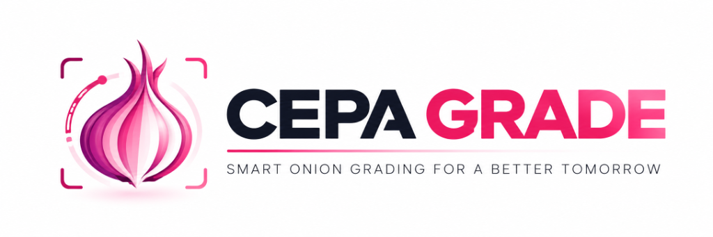
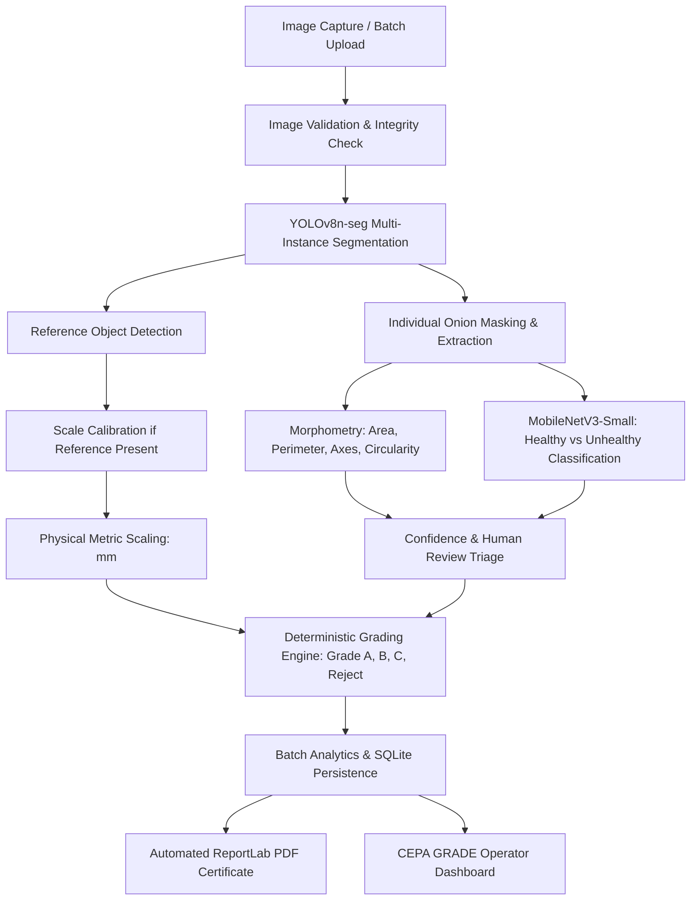
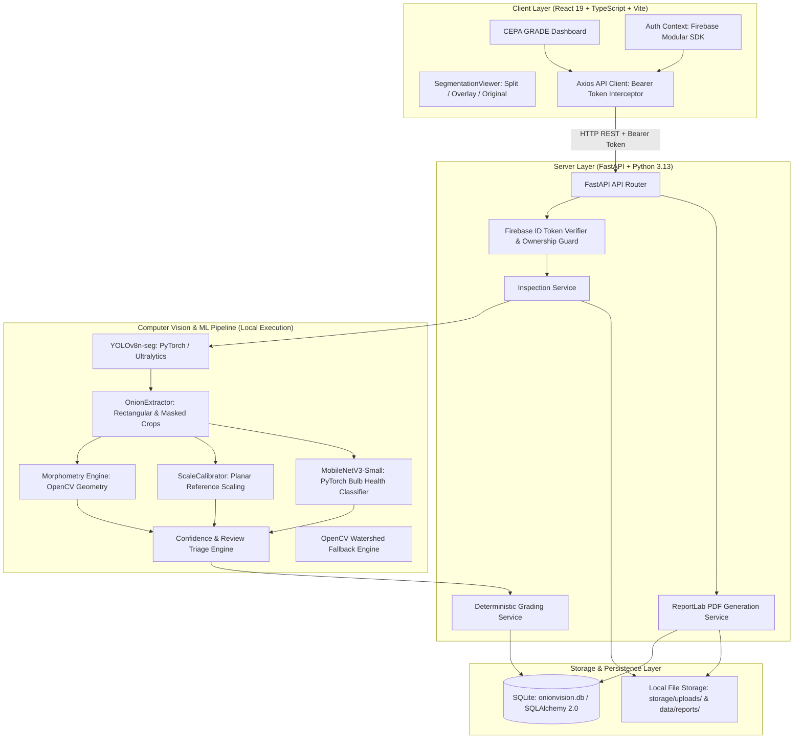
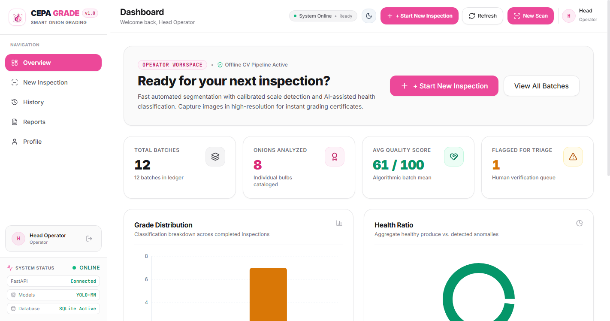
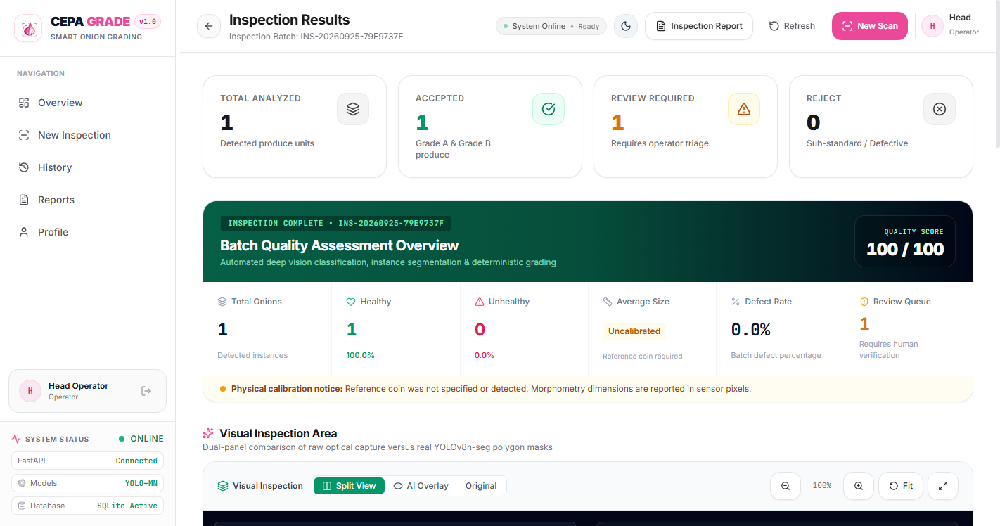
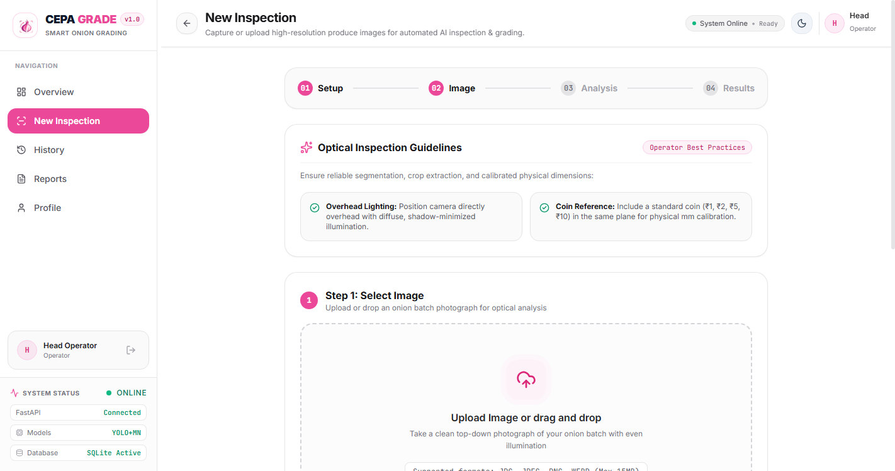
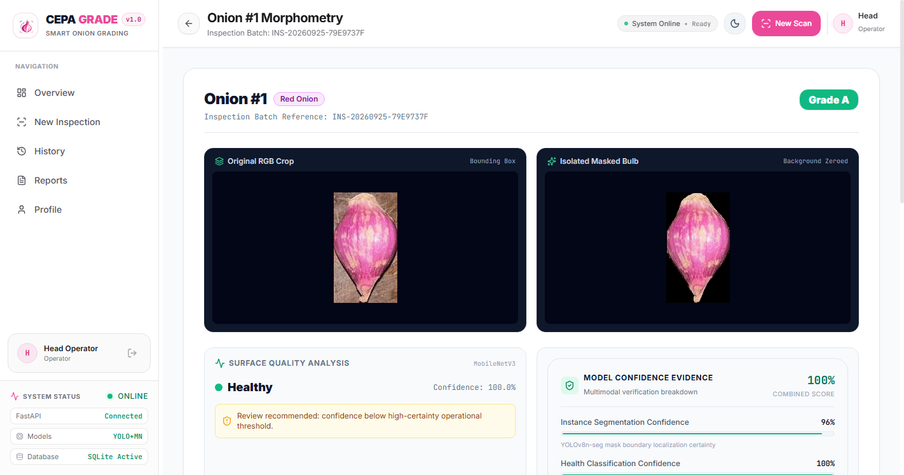
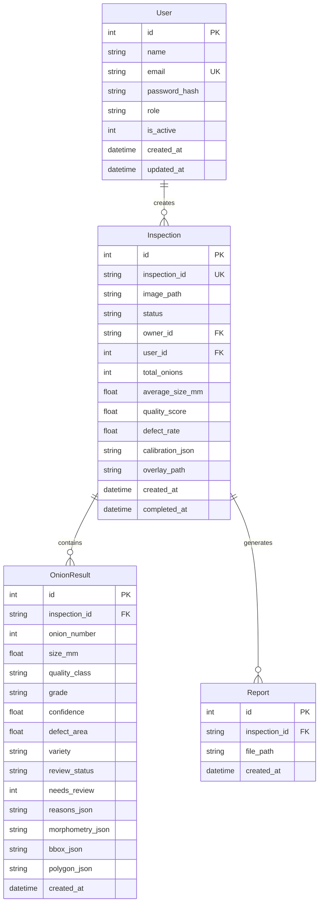

<div align="center">



# CEPA GRADE
### AI-Based Onion Quality Inspection and Automated Grading System

**Smart Onion Grading for a Better Tomorrow**

[](https://www.python.org/)
[](https://fastapi.tiangolo.com/)
[](https://pytorch.org/)
[](https://docs.ultralytics.com/)
[](https://react.dev/)
[](https://www.typescriptlang.org/)
[](https://vitejs.dev/)
[](https://tailwindcss.com/)
[](https://www.sqlite.org/)
[](#automated-testing--benchmarking)

<br />

**CEPA GRADE** is an operator-focused computer-vision and deep-learning system designed for automated post-harvest onion inspection, quality assessment, grading assistance, batch analytics, and digital reporting. Built for local, low-latency execution, it pairs two trained neural network models—**YOLOv8n-seg** for multi-onion instance segmentation and reference-target localization, and **MobileNetV3-Small** for individual bulb health classification—with classical OpenCV morphometry, planar reference-scale calibration, a deterministic explainable grading engine, and automated PDF report generation.

</div>

---

## Table of Contents

- [1. Project Overview](#1-project-overview)
- [2. Problem Statement](#2-problem-statement)
- [3. Our Solution](#3-our-solution)
- [4. Key Features](#4-key-features)
- [5. System Architecture](#5-system-architecture)
- [6. Complete AI & Computer Vision Pipeline](#6-complete-ai--computer-vision-pipeline)
  - [6.1 Image Ingestion & Validation](#61-image-ingestion--validation)
  - [6.2 Multi-Instance Segmentation (YOLOv8n-seg)](#62-multi-instance-segmentation-yolov8n-seg)
  - [6.3 Quality Gate & Masked Crop Extraction](#63-quality-gate--masked-crop-extraction)
  - [6.4 Morphometric & Geometric Analysis](#64-morphometric--geometric-analysis)
  - [6.5 Reference-Based Scale Calibration](#65-reference-based-scale-calibration)
  - [6.6 Bulb Health Classification (MobileNetV3-Small)](#66-bulb-health-classification-mobilenetv3-small)
  - [6.7 Confidence & Human Review Triage](#67-confidence--human-review-triage)
  - [6.8 Classical OpenCV Watershed Fallback](#68-classical-opencv-watershed-fallback)
  - [6.9 Deterministic Explainable Grading Engine](#69-deterministic-explainable-grading-engine)
- [7. Model Performance & Benchmarks](#7-model-performance--benchmarks)
- [8. Datasets & Data Governance](#8-datasets--data-governance)
- [9. Technology Stack](#9-technology-stack)
- [10. Operator Frontend Experience](#10-operator-frontend-experience)
- [11. Visual Inspection Viewer](#11-visual-inspection-viewer)
- [12. Backend REST API](#12-backend-rest-api)
- [13. Authentication & Security](#13-authentication--security)
- [14. Database Architecture](#14-database-architecture)
- [15. Automated PDF Reporting Engine](#15-automated-pdf-reporting-engine)
- [16. Repository Structure](#16-repository-structure)
- [17. Installation & Setup Guide](#17-installation--setup-guide)
- [18. Running CEPA GRADE](#18-running-cepa-grade)
- [19. Demonstration Workflow](#19-demonstration-workflow)
- [20. Automated Testing & Verification](#20-automated-testing--verification)
- [21. Technical Limitations & Non-Certification Boundary](#21-technical-limitations--non-certification-boundary)
- [22. Frequently Asked Questions (FAQ)](#22-frequently-asked-questions-faq)
- [23. Roadmap & Future Work](#23-roadmap--future-work)
- [24. Project Documentation & Engineering Reports](#24-project-documentation--engineering-reports)
- [25. Technical References](#25-technical-references)
- [26. License & Support](#26-license--support)

---

## 1. Project Overview

Agricultural post-harvest processing of allium vegetables (specifically red and yellow onions) represents a major bottleneck in agricultural supply chains. Today, quality sorting in sorting centers and mandi yards is carried out almost entirely through manual, visual inspection.

**CEPA GRADE** provides an automated, objective, and reproducible alternative. The operator captures or uploads a batch photograph of produce laid out on an inspection surface. Within milliseconds, the system detects every individual bulb, segments its exact boundaries, measures its contour geometry, evaluates its surface health using a trained neural network, estimates physical millimeters when a calibrated scale reference is present, assigns an explainable prototype grade, and generates an audit-ready PDF inspection certificate.



---

## 2. Problem Statement

Commercial onion quality appraisal relies heavily on human visual judgment, which presents fundamental operational challenges:

1. **Subjective & Inconsistent Sorting:** Visual appraisal varies significantly across human inspectors, fatigue levels, and ambient lighting conditions.
2. **Speed & Throughput Constraints:** Individual bulb inspection is labor-intensive, limiting the volume of produce that can be evaluated during peak harvests.
3. **Absence of Traceable Digital Records:** Manual lots are rarely recorded digitally with individual bulb measurements, hindering batch traceability and dispute resolution.
4. **Uncalibrated Metric Estimations:** Visual approximations of bulb diameters frequently result in miscategorized commercial grade allocations.
5. **No Verification Audit Trail:** Buyers and grading yards lack objective documentation validating lot quality prior to transit.

CEPA GRADE solves these challenges by combining computer vision instance segmentation, neural quality classification, deterministic grading heuristics, and automated reporting into an accessible, operator-friendly tool.

---

## 3. Our Solution

CEPA GRADE establishes an **operator-first, multi-stage computer-vision inspection pipeline** that prioritizes transparency, explainability, and speed:

- **Two Focused Neural Models Instead of a Monolith:** Rather than training a single, black-box model to perform everything, CEPA GRADE decouples instance segmentation from quality evaluation. A fast **YOLOv8n-seg** model isolates individual bulbs and calibration targets, while a dedicated **MobileNetV3-Small** classifier evaluates surface health on normalized individual bulb crops.
- **Scientifically Grounded Morphometry:** OpenCV extracts exact geometric properties (contour area, perimeter, fitted ellipse axes, aspect ratio, circularity, equivalent diameter).
- **Honest Physical Metrology:** Physical dimensions are calculated **only** when a planar reference marker is detected and a known physical constant is provided. When unavailable, millimeter metrics are strictly labeled as `null` with explicit `CALIBRATION_CONSTANT_REQUIRED` notices rather than fabricated approximations.
- **Deterministic Explainability:** Grading decisions are governed by transparent, deterministic rule engines that output explicit human-readable reasons (e.g., *"Physical size (52.4 mm) falls in optimal Grade A range (45–75 mm)"*).
- **Human-in-the-Loop Triage:** Bulbs with borderline confidence, severe cluster overlaps, or missing calibration are automatically tagged as `REVIEW_RECOMMENDED` or `MANUAL_REVIEW_REQUIRED`, ensuring operators retain ultimate control.

---

## 4. Key Features

| Domain | Implemented Capability | Technical Description |
| :--- | :--- | :--- |
| **Inspection** | Batch Image Upload | Supports JPEG, PNG, WEBP files up to 15 MB with path-traversal security guards. |
| | Instance Segmentation | YOLOv8n-seg detects and segments multiple individual red and yellow onions per frame. |
| | Reference Localization | Automatically identifies calibration reference targets to enable scale calibration. |
| **Analysis** | Dual-Crop Extraction | Generates both rectangular bounding crops and isolated masked crops with background zeroed. |
| | Geometric Morphometry | Computes contour area, perimeter, fitted ellipse major/minor axes, circularity, and aspect ratio. |
| | Health Classification | MobileNetV3-Small classifies bulb surface health (`Healthy` vs `Unhealthy`) on masked crops. |
| | Confidence Triage | Deterministic weighted scoring ($0.40 \times \text{seg} + 0.60 \times \text{qual}$) with 3 review tiers. |
| | Classical Fallback | Marker-controlled Watershed segmentation activates if deep learning weights are unconfigured. |
| **Grading** | Deterministic Grading | Heuristic tiers: `Grade A`, `Grade B`, `Grade C`, `Reject` based on health, size, and defect area. |
| | Explainable Reasons | Detailed textual justifications stored per bulb explaining exactly why a grade was assigned. |
| | Batch Aggregation | Calculates total bulbs, mean size, quality score index (0–100), defect rate, and grade distributions. |
| **Visualization** | Split Comparison | Side-by-side synchronized view comparing the **Original Capture** with the **AI Inspection**. |
| | AI Overlay Mode | Renders real YOLOv8n-seg polygon masks, bounding boxes, class labels, and instance counts. |
| | Original Capture Mode | Clean viewing mode displaying the raw uploaded produce photograph without annotations. |
| | Interactive Controls | Smooth zoom (50%–300%), pan on magnification, 100% viewport fit, and fullscreen inspection. |
| | Dynamic Class Legend | Intelligently displays only the classes present in the active batch (`Red`, `Yellow`, `Reference`, `Defect`). |
| **Reporting** | Automated PDF Export | ReportLab two-pass engine compiling inspection summaries, overlays, crops, and metrology audits. |
| | Metrology Transparency | Explicit notices distinguishing verified calibrated metric units from uncalibrated pixel measurements. |
| **Security** | Firebase Authentication | Enterprise-grade email/password authentication, email verification enforcement, and ID tokens. |
| | Resource Isolation | SQLite `owner_id` scoping ensures operators only access their own inspections and reports. |

---

## 5. System Architecture

CEPA GRADE adopts a modular client-server architecture with strict separation of concerns:



---

## 6. Complete AI & Computer Vision Pipeline

```
Raw Batch Image
   │
   ▼
[ 1. Image Validation ] ──► Validates MIME, dimensions, file size (<= 15MB)
   │
   ▼
[ 2. YOLOv8n-seg ] ───────► Predicts polygons & boxes for Red Onion, Yellow Onion, Reference Object
   │
   ▼
[ 3. Quality Gate ] ─────► Rejects degenerate masks (< 15x15 px or < 80 visible pixels)
   │
   ├──► [ 4. Crop Extraction ] ──► Generates rectangular RGB crop & precision binary-masked crop
   │
   ├──► [ 5. Morphometry ] ─────► Computes contour area, perimeter, major/minor axes, circularity
   │
   ├──► [ 6. Calibration ] ─────► Computes mm/pixel scale if Reference-Object detected + constant set
   │
   └──► [ 7. MobileNetV3 ] ─────► Evaluates surface quality: Healthy vs Unhealthy (224x224 masked crop)
   │
   ▼
[ 8. Confidence Triage ] ──► Combines scores (0.40 seg + 0.60 qual); tags Auto, Review, or Manual
   │
   ▼
[ 9. Grading Engine ] ────► Evaluates health + size; assigns Grade A, Grade B, Grade C, or Reject
   │
   ▼
[ 10. Persistence ] ──────► Records batch metrics and child records in SQLite database
```

### 6.1 Image Ingestion & Validation
Incoming uploads via `POST /api/inspections` pass through strict defensive filters:
- **Format Verification:** Validates magic bytes and MIME types (`image/jpeg`, `image/png`, `image/webp`).
- **Payload Limits:** Maximum allowed upload size is 15 MB (`MAX_UPLOAD_SIZE_BYTES=15728640`).
- **Filename Sanitization:** Input filenames are stripped of path traversal characters (`..`, `/`, `\`) and stored with a deterministic identifier: `INS-{YYYYMMDD}-{UUID8}`.

### 6.2 Multi-Instance Segmentation (YOLOv8n-seg)
The primary segmentation stage is powered by a custom-trained **Ultralytics YOLOv8n-seg** model:
- **Weights:** `ml/models/onion_segmentation_yolov8n.pt` (6.78 MB, 3.26M parameters).
- **Execution:** Runs in single-stage anchor-free mode on the GPU (or CPU fallback) at native input resolution.
- **Classes Detected:**
  - `Class 0`: `Red-Onion` (Instance polygon mask & bounding box)
  - `Class 1`: `Reference-Object` (Calibration target marker)
  - `Class 2`: `Yellow-Onion` (Instance polygon mask & bounding box)
- **Output:** Individual polygon vertex contours $[[x_1, y_1], [x_2, y_2], \dots]$, bounding boxes $[x_{\min}, y_{\min}, x_{\max}, y_{\max}]$, and detection confidence.

### 6.3 Quality Gate & Masked Crop Extraction
Located in `backend/app/cv/extractor.py`, the crop extractor isolates each bulb:
- **Bounding Box Crop:** Extracts a rectangular RGB slice with safety clipping to image boundaries.
- **Masked Crop:** Applies the binary segmentation polygon mask to zero-out (blacken) all background pixels outside the bulb contour. This eliminates background clutter and neighboring onions from corrupting subsequent classification.
- **Quality Rejection Gate:** Discards degenerate or noisy detections with bounding dimensions $< 15 \times 15$ pixels or $< 80$ visible mask pixels.

### 6.4 Morphometric & Geometric Analysis
Located in `backend/app/cv/morphometry.py`, the morphometry engine derives geometric attributes:
- **Contour Area ($A$):** Calculated via Green's theorem via `cv2.contourArea(contour)`.
- **Perimeter ($P$):** Arc length calculated via `cv2.arcLength(contour, closed=True)`.
- **Fitted Ellipse Axes:** Fits a rotated ellipse using algebraic distance minimization (`cv2.fitEllipse`) for contours with $\ge 5$ vertices to extract **major axis** ($D_{\text{major}}$) and **minor axis** ($D_{\text{minor}}$).
- **Aspect Ratio:** $AR = \frac{D_{\text{major}}}{D_{\text{minor}}}$. Identifies elongated, split, or deformed twin bulbs ($AR > 1.80$).
- **Circularity:** $C = \frac{4 \pi A}{P^2}$. Evaluates compactness (1.0 represents a mathematically perfect circle).
- **Equivalent Diameter:** $D_{\text{eq}} = \sqrt{\frac{4 A}{\pi}}$ in pixel units.

### 6.5 Reference-Based Scale Calibration
Located in `backend/app/cv/calibration.py`, the calibration module bridges image pixels and metric dimensions:
1. When `Reference-Object` is detected, its equivalent pixel diameter $D_{\text{ref\_px}}$ is extracted.
2. If a known physical reference dimension (e.g., a standard coin of $25.0\text{ mm}$) is configured:
   $$\text{mm\_per\_pixel} = \frac{\text{known\_reference\_diameter\_mm}}{D_{\text{ref\_px}}}$$
   $$\text{size\_mm} = D_{\text{major\_px}} \times \text{mm\_per\_pixel}$$
3. **Strict Metrology Rule:** If no reference target is found or no reference diameter constant is supplied, the system sets `size_mm = null` and records `status = "CALIBRATION_CONSTANT_REQUIRED"`. It **never** guesses physical scale. All calibrated dimensions are tagged as `ESTIMATED`.

### 6.6 Bulb Health Classification (MobileNetV3-Small)
Located in `backend/app/ml/quality.py`, health classification evaluates individual masked crops:
- **Weights:** `ml/models/onion_health_mobilenetv3_small.pth` (6.22 MB, 2.54M parameters).
- **Architecture:** PyTorch `MobileNetV3-Small` backbone with a custom linear classification head.
- **Input:** $224 \times 224$ normalized RGB masked crop.
- **Classes:** `Healthy` (Class 0) vs `Unhealthy` (Class 1).
- **No Fabricated Defect Types:** Public agricultural datasets support binary bulb health verification. CEPA GRADE does not invent unverified sub-defect labels (such as internal neck rot or black mould).

### 6.7 Confidence & Human Review Triage
Located in `backend/app/cv/confidence.py`, the triage engine combines multi-modal evidence into an explainable review state:
- **Overall Confidence Formula:**
  $$\text{Confidence}_{\text{overall}} = 0.40 \times \text{Confidence}_{\text{seg}} + 0.60 \times \text{Confidence}_{\text{qual}}$$
- **Review Categorization:**
  - `AUTO_ACCEPTABLE`: Segmentation $\ge 0.60$, quality $\ge 0.70$, aspect ratio $\le 1.80$, circularity $\ge 0.50$, and calibrated scale.
  - `REVIEW_RECOMMENDED`: Borderline confidence, uncalibrated scale, elongated shape ($AR > 1.80$), or dense touching cluster.
  - `MANUAL_REVIEW_REQUIRED`: Invalid crop/mask, critically low confidence ($< 0.40$), or degenerate geometry.

### 6.8 Classical OpenCV Watershed Fallback
Located in `backend/app/cv/watershed.py`, a classical computer-vision engine provides operational continuity:
- **Algorithm:** Morphological opening, Euclidean distance transform, peak thresholding, and marker-controlled watershed segmentation.
- **Trigger:** Activates when YOLO weights are missing, if CUDA runtime fails, or when explicitly requested via `force_watershed=True`.
- **Traceability:** Segmented instances are explicitly tagged with `source = "watershed"`.

### 6.9 Deterministic Explainable Grading Engine
Located in `backend/app/services/grading_service.py`, grading applies transparent heuristic rules:

| Grade Tier | Quality Class | Physical Size ($mm$) | Defect Area | Commercial Description |
| :--- | :--- | :--- | :--- | :--- |
| **Grade A** | `Healthy` | $45.0 \le \text{size} \le 75.0$ | $\le 5.0\%$ | Optimal market produce: sound health, uniform size, negligible blemishes. |
| **Grade B** | `Healthy` | $35.0 \le \text{size} < 45.0$ OR $75.0 < \text{size} \le 90.0$ | $\le 10.0\%$ | Good commercial grade: sound health with minor size variance. |
| **Grade C** | `Healthy` | $< 35.0$ OR $> 90.0$ | $\le 20.0\%$ | Marginal grade: undersized or oversized bulbs with moderate blemishes. |
| **Reject** | `Unhealthy` | Any | $> 20.0\%$ | Non-commercial: visible disease, severe damage, or rot. |

*Note: If scale calibration is unavailable (`size_mm` is `null`), the engine grades based on health classification and defect area, appending an advisory reason rather than rejecting produce.*

---

## 7. Model Performance & Benchmarks

All metrics below represent **actual evaluated values** measured on held-out test splits and verified on an NVIDIA GeForce RTX 4050 Laptop GPU (CUDA 12.6, PyTorch 2.14.0):

### 7.1 Instance Segmentation Model (YOLOv8n-seg)
Evaluated on the held-out test split of 672 images and 3,410 targets:

| Metric | Measured Value | Metric | Measured Value |
| :--- | :--- | :--- | :--- |
| **Model Architecture** | `YOLOv8n-seg` | **Parameters** | 3,264,201 (3.26M) |
| **Model Size** | 6.78 MB | **FLOPs** | 11.5 GFLOPs |
| **Training Epochs** | 15 epochs (AdamW) | **Input Resolution** | $640 \times 640$ pixels |
| **Box Precision** | **99.99%** (0.9999) | **Mask Precision** | **94.95%** (0.9495) |
| **Box Recall** | **58.03%** (0.5803) | **Mask Recall** | **54.91%** (0.5491) |
| **Box mAP@50** | **67.51%** (0.6751) | **Mask mAP@50** | **57.68%** (0.5768) |
| **Box mAP@50-95** | **61.49%** (0.6149) | **Mask mAP@50-95** | **43.53%** (0.4353) |
| **Model Load Latency** | 45.25 ms | **Mean Inference Latency** | **26.30 ms** (38.0 FPS) |

### 7.2 Bulb Health Classification Model (MobileNetV3-Small)
Evaluated on the held-out test split of 1,840 deduplicated onion bulb images:

| Metric | Measured Value | Metric | Measured Value |
| :--- | :--- | :--- | :--- |
| **Model Architecture** | `MobileNetV3-Small` | **Parameters** | 2,542,882 (2.54M) |
| **Model Size** | 6.22 MB | **Input Resolution** | $224 \times 224$ pixels |
| **Training Epochs** | 10 epochs (CosineAnneal) | **Overall Accuracy** | **99.84%** (0.9984) |
| **Unhealthy Precision** | **100.0%** (1.0000) | **Unhealthy Recall** | **99.50%** (0.9950) |
| **Unhealthy F1-Score** | **0.9975** | **Mean Inference Latency** | **17.84 ms** (56.1 FPS) |

**Test Split Confusion Matrix (1,840 Test Images):**
- True Healthy predicted Healthy: **1,235**
- True Healthy predicted Unhealthy (False Positives): **0**
- True Unhealthy predicted Healthy (False Negatives): **3** (0.50% missed defect rate)
- True Unhealthy predicted Unhealthy (True Positives): **602**

### 7.3 End-to-End Pipeline Stage Latency (Benchmark: 25 Iterations)

| Pipeline Stage | Mean Latency (ms) | Median Latency (ms) | p95 Latency (ms) |
| :--- | :--- | :--- | :--- |
| **1. YOLOv8n-seg Segmentation** | 25.13 ms | 25.31 ms | 27.90 ms |
| **2. Masked Crop Extraction** | 1.92 ms | 1.91 ms | 3.32 ms |
| **3. Morphometry & Geometry** | 0.28 ms | 0.25 ms | 0.44 ms |
| **4. MobileNetV3-Small Classification** | 25.32 ms | 23.49 ms | 38.98 ms |
| **5. Deterministic Grading Engine** | 0.06 ms | 0.06 ms | 0.10 ms |
| **6. SQLite Database Persistence** | 11.69 ms | 11.17 ms | 13.06 ms |
| **Total End-to-End Pipeline** | **68.40 ms** | **65.42 ms** | **86.13 ms** |
| **Continuous Inspection Throughput** | **14.6 FPS** | **15.3 FPS** | — |

> **Latency Context & Measurement Methodology:**  
> During preliminary model integration (Phase 03), the standalone neural inference pipeline measured **49.64 ms** mean latency without individual masked crop extraction, without complete OpenCV morphometry, and without database persistence. In Phase 04, the complete production pipeline adds bounding-crop isolation, background-zeroed masked crop extraction, fitted-ellipse morphometry, planar reference calibration, deterministic grading, and SQLite transaction persistence, resulting in the final measured **68.40 ms** mean end-to-end latency (~14.6 FPS continuous throughput).

---

## 8. Datasets & Data Governance

CEPA GRADE was trained and evaluated on audited, real-world image datasets totaling **21,154 raw images**:

| Dataset Name | Source & Provenance | Image Count | Annotations | Task in CEPA GRADE | License |
| :--- | :--- | :--- | :--- | :--- | :--- |
| **Onion Segmentation (v7-full)** | Roboflow Universe | 4,849 images (640x640) | 13,927 COCO polygons | Multi-onion instance segmentation & scale reference detection | CC BY 4.0 |
| **Red and White Onion Bulbs and Leaves** | Mendeley Data (`doi:10.17632/42bcyncfhy.1`) | 16,300 images (1024x768) | 16,300 folder labels | Bulb health classification (12,233 usable deduplicated bulbs) | CC BY 4.0 |
| **Produce Sorting Sanity Samples** | Harvard Dataverse | 5 images (varied) | Unannotated | External visual inference validation & sanity checking | Open |

### Detailed Dataset Breakdown & Harmonization:

#### Dataset 2 (Mendeley Allium Dataset) Filtering & Deduplication:
To ensure scientific rigor, the raw 16,300-image Mendeley archive was filtered to isolate only relevant post-harvest produce:
1. **Original Raw Archive:** 16,300 total images (12,260 bulb photographs + 4,040 leaf photographs).
2. **Post-Harvest Filtering:** All 4,040 leaf images (24.8% of archive) were filtered out, leaving **12,260 onion bulb images** (8,220 Healthy, 4,040 Unhealthy).
3. **Internal Hash Deduplication:** MD5 cryptographic auditing identified 28 identical image clusters (29 redundant duplicate files, all within matching class subfolders). Removing these yielded **12,233 unique, usable bulb images**.
4. **Stratified Partitioning:** The 12,233 usable bulbs were split into stratified partitions:
   - **Training Set (70%):** 8,562 images (5,753 Healthy, 2,809 Unhealthy)
   - **Validation Set (15%):** 1,831 images (1,231 Healthy, 600 Unhealthy)
   - **Held-Out Test Set (15%):** 1,840 images (1,235 Healthy, 605 Unhealthy)

#### Dataset 1 (Roboflow Onion Segmentation) Split Correction:
- **Total Images:** 4,849 images with 13,927 COCO instance annotations across `Red-Onion` (4,452), `Yellow-Onion` (4,626), and `Reference-Object` (4,849 — 100% presence).
- **Split Defect Remediation:** The raw export contained 0 yellow onions in validation; a stratified 70/15/15 re-partition was generated (3,393 train, 727 validation, 729 test) ensuring balanced multi-class evaluation.

### Data Governance & Integrity Safeguards:
- **Zero Cross-Contamination:** SHA-256 and MD5 hash auditing verified 0 shared images across all three datasets.
- **Zero Synthetic Training Images:** All neural networks were trained exclusively on real-world camera captures; zero synthetic, diffusion-generated, or fabricated images were used.
- **Strict Label Fidelity:** Defect classifications strictly adhere to verified source labels (`Healthy` vs `Unhealthy`). No unverified sub-defect categories (such as internal neck rot or black mould) were fabricated.

---

## 9. Technology Stack

| Layer | Technology | Version | Purpose in CEPA GRADE |
| :--- | :--- | :--- | :--- |
| **Frontend Framework** | React | `^19.2.8` | Declarative user interface and component architecture |
| **Language** | TypeScript | `~6.0.2` | Type-safe application development across UI and API bindings |
| **Build Tool** | Vite | `^8.3.0` | Ultra-fast development server and optimized production bundler |
| **Styling** | Tailwind CSS | `^3.4.19` | Design tokens, responsive layout grid, and dark/light theming |
| **Icons & UI** | Lucide React | `^1.48.0` | Consistent iconography across navigation and status indicators |
| **Charts** | Recharts | `^3.10.1` | Grade distribution and batch health ratio data visualizations |
| **Client Auth** | Firebase Web SDK | `^12.19.0` | Modular identity management, token lifecycle, email verification |
| **Backend Framework** | FastAPI | `>=0.115.0` | High-performance asynchronous REST API framework |
| **ASGI Server** | Uvicorn | `>=0.32.0` | High-throughput asynchronous ASGI web server |
| **Deep Learning** | PyTorch / Torchvision | `2.14.0+cu126` | Deep learning execution engine with CUDA acceleration |
| **Segmentation** | Ultralytics YOLOv8 | `8.4.163` | Single-stage instance segmentation inference engine |
| **Computer Vision** | OpenCV (`cv2`) | `>=4.10.0` | Morphometry, ellipse fitting, contours, watershed fallback |
| **Image Processing** | Pillow (PIL) | `>=11.0.0` | Image format validation, cropping, and color conversions |
| **Database** | SQLite + SQLAlchemy | `>=2.0.35` | Relational database persistence with declarative ORM |
| **PDF Reporting** | ReportLab | `>=4.0.0` | Deterministic two-pass PDF inspection report generator |
| **Server Auth** | PyJWT / Argon2 / Firebase | `>=2.8.0` | Cryptographic JWT verification and password hashing |

---

## 10. Operator Frontend Experience

The CEPA GRADE frontend provides a purpose-built workspace designed around an operator's daily inspection flow:

<div align="center">

| Operator Dashboard | Inspection Results & Visual Viewer |
| :---: | :---: |
|  |  |

| New Inspection Capture | Individual Onion Morphometry |
| :---: | :---: |
|  |  |

</div>

### Verified Application Pages & Routes:
- `/` — **Dashboard / Overview:** Real-time summary cards (total batches, total onions, mean quality score, triage count), interactive grade distribution bar charts, and health ratio donut charts.
- `/new` — **New Inspection:** Batch image upload dropzone with real-time file validation, optional scale reference input, and instant execution toggle.
- `/inspections/:id` — **Inspection Analysis:** High-level execution summary, batch status indicator, and triage advisories.
- `/inspections/:id/results` — **Inspection Results:** Hero grade card, the interactive Visual Inspection Area, aggregated batch metrics, and individual bulb cards.
- `/inspections/:id/onions/:onionId` — **Onion Detail Page:** In-depth breakdown of a single detected onion showing bounding crop, masked crop, geometry table, and grading reasons.
- `/inspections/:id/report` — **Report View:** In-browser inspection report preview and direct PDF download button.
- `/history` — **History / Batches:** Paginated, searchable ledger of completed inspection batches with grade badges and timestamps.
- `/reports` — **Reports Center:** Central repository of generated inspection certificates and download links.
- `/profile` — **Profile & Identity:** Authenticated operator information, role badge, session status, and active identity provider indicator.
- `/login` & `/signup` — **Authentication:** Secure operator onboarding with password hashing and email verification notices.

---

## 11. Visual Inspection Viewer

The **Visual Inspection Area** is the core interactive workspace for evaluating model output:

```
┌────────────────────────────────────────────────────────────────────────┐
│  [ImageIcon] Inspection View   [Split View]  [AI Overlay]  [Original]  │
│                                           [-] 100% [+]  [Fit]  [Full]  │
├──────────────────────────────────┬─────────────────────────────────────┤
│  [Original Capture]              │  [● AI Inspection]                  │
│                                  │                                     │
│  Real uploaded batch photograph  │  Real YOLOv8n-seg polygon masks     │
│  (contained, un-stretched)       │  + bounding boxes + class labels    │
│                                  │                                     │
├──────────────────────────────────┴─────────────────────────────────────┤
│  Class Legend:  [● Red]  [● Yellow]  [● Reference]  [● Defect]         │
│                                                    Detected Onions: 8  │
└────────────────────────────────────────────────────────────────────────┘
```

### Key Engineering Capabilities:
1. **Three Viewing Modes:**
   - **Split View:** Side-by-side comparison displaying the original produce capture alongside the active YOLOv8n-seg overlay.
   - **AI Overlay:** Single-viewport inspection showing real polygon masks, bounding boxes, and detection confidence.
   - **Original Capture:** Raw produce image view without annotations.
2. **Authenticated Asset Pipeline:** Images and overlays are fetched via authenticated Axios blob requests (`responseType: 'blob'`) using the active session token, falling back to secure query token parameters (`?token=...`). Native browser broken-image icons are completely eliminated.
3. **Aspect Ratio Preservation:** Uses CSS `object-contain` across both panels. Never stretches or crops onion boundaries.
4. **Interactive Zoom & Pan:** Defaults to a true 100% viewport fit. Interactive zoom in/out (50% to 300%) with grab-to-pan enabled when magnified beyond 1x.
5. **Dynamic Class Legend:** Evaluates the active inspection result to display **only** classes detected in the scene, avoiding false implications of defects on clean batches.
6. **Resilient Error States:** If source media is missing, displays an informative error card with a retry button instead of a broken image icon.

---

## 12. Backend REST API

The FastAPI backend exposes 20 operational REST API endpoints under `/api` alongside the root service status route:

| Method | Endpoint | Description | Auth Required |
| :--- | :--- | :--- | :---: |
| `GET` | `/` | Root entry point returning service health, version, and docs link | Public |
| `GET` | `/api/health` | Service health status and ML model operational readiness | Public |
| `POST` | `/api/auth/signup` | Register new operator account | Public |
| `POST` | `/api/auth/login` | Authenticate operator and obtain access token | Public |
| `GET` | `/api/auth/me` | Retrieve profile of authenticated user | Bearer Token |
| `POST` | `/api/auth/logout` | Invalidate client session | Bearer Token |
| `POST` | `/api/inspections` | Upload batch image (optional auto-process & calibration diameter) | Bearer Token |
| `POST` | `/api/inspections/{id}/process` | Execute full CV pipeline on saved inspection | Bearer Token |
| `GET` | `/api/inspections` | List inspection history (paginated with `skip` & `limit`) | Bearer Token |
| `GET` | `/api/inspections/{id}` | Retrieve complete inspection record and metrics | Bearer Token |
| `GET` | `/api/inspections/{id}/results` | Retrieve list of all detected onions and individual grades | Bearer Token |
| `GET` | `/api/inspections/{id}/report` | Retrieve inspection report status and metadata | Bearer Token |
| `GET` | `/api/inspections/{id}/report/pdf` | Download official inspection report PDF binary | Bearer Token |
| `GET` | `/api/inspections/{id}/image` | Safely stream uploaded inspection source image | Bearer / Token Query |
| `GET` | `/api/inspections/{id}/overlay` | Stream rendered AI segmentation overlay image | Bearer / Token Query |
| `GET` | `/api/inspections/{id}/onions/{n}` | Retrieve detailed morphometry for single onion | Bearer Token |
| `GET` | `/api/inspections/{id}/onions/{n}/crop` | Stream rectangular bounding box crop image | Bearer / Token Query |
| `GET` | `/api/inspections/{id}/onions/{n}/mask` | Stream isolated masked crop (background zeroed) | Bearer / Token Query |
| `GET` | `/api/reports/{id}` | Convenience route for report metadata | Bearer Token |
| `GET` | `/api/reports/{id}/pdf` | Convenience route for report PDF download | Bearer Token |
| `GET` | `/api/results/{id}` | Convenience route for individual onion results | Bearer Token |

*Interactive Swagger UI documentation is available at [http://localhost:8000/docs](http://localhost:8000/docs) when running locally.*

---

## 13. Authentication & Security

```
React Frontend (Vite)
   │
   ▼
Firebase Modular Web SDK (createUserWithEmailAndPassword / signInWithEmailAndPassword)
   │
   ▼
Firebase ID Token (JWT)
   │
   ▼
Axios Request Interceptor: Authorization: Bearer <FIREBASE_ID_TOKEN>
   │
   ▼
FastAPI Dependency: get_current_user (backend/app/core/deps.py)
   │
   ▼
Firebase Admin SDK Cryptographic Verification (backend/app/core/firebase_auth.py)
   │
   ├──► Enforces email_verified == True (rejects unverified users with HTTP 403)
   │
   ▼
Authenticated User Resolved (Firebase UID)
   │
   ▼
SQLite Query Scoping: WHERE owner_id == current_user.id
```

### Security Principles & Defensive Measures:
- **Zero Secrets in Repository:** All `.env` files, Firebase service account credentials (`*firebase*.json`, `*service-account*.json`), and database files are strictly ignored by `.gitignore`.
- **Token Cryptography:** Client requests transmit standard Firebase ID tokens verified server-side against Google's public key infrastructure.
- **Resource Ownership Scoping:** Every inspection is stamped with the creator's verified `owner_id`. Operators cannot read, process, or download inspections created by other users (HTTP 403 Forbidden).
- **Path Traversal Protection:** All file-serving and report routes sanitize inputs with strict regular expressions (`^INS-[A-Za-z0-9_-]+$`) and verify that target paths resolve strictly within designated storage boundaries.
- **GitHub Recommended Protections:** GitHub secret scanning, push protection, and Dependabot vulnerability alerts are recommended to safeguard public deployments.

---

## 14. Database Architecture

CEPA GRADE uses **SQLite** through **SQLAlchemy 2.0 ORM** for local persistence without database server overhead:



---

## 15. Automated PDF Reporting Engine

Inspection reports are compiled deterministically and entirely offline using **ReportLab**:

- **Two-Pass NumberedCanvas:** Dynamically calculates total pages to render headers and `"Page X of Y"` footers.
- **Embedded Visual Assets:** Dynamically formats and embeds the full-resolution segmentation overlay and individual bounding crops with aspect-ratio preservation.
- **Honest Metrology Audit:** Every report contains an explicit notice declaring whether dimensions were derived using a verified reference calibration target or represent uncalibrated pixel measurements.
- **High Performance:** Compiles a multi-page, image-embedded technical inspection certificate in **44.2 ms mean latency** (~121 KB file size).

---

## 16. Repository Structure

```
ONION/
├── backend/                        # FastAPI Backend Application
│   ├── app/
│   │   ├── api/                    # REST API route controllers
│   │   │   ├── auth.py             # Authentication endpoints
│   │   │   ├── health.py           # Health and readiness check
│   │   │   ├── inspections.py      # Core inspection endpoints
│   │   │   ├── reports.py          # Report metadata endpoints
│   │   │   └── results.py          # Onion result endpoints
│   │   ├── core/                   # Application settings & security
│   │   │   ├── config.py           # Pydantic environment settings
│   │   │   ├── deps.py             # Dependency injection & auth guards
│   │   │   ├── firebase_auth.py    # Firebase token verifier
│   │   │   └── security.py         # Password hashing & access tokens
│   │   ├── cv/                     # Computer vision pipeline modules
│   │   │   ├── calibration.py      # Reference-based scale calibration
│   │   │   ├── confidence.py       # Confidence triage engine
│   │   │   ├── extractor.py        # Masked crop extractor
│   │   │   ├── morphometry.py      # Contour geometric analysis
│   │   │   ├── pipeline.py         # End-to-end CV coordinator
│   │   │   └── watershed.py        # Classical watershed fallback
│   │   ├── db/                     # SQLite database models & engine
│   │   │   ├── database.py         # SQLAlchemy session factory
│   │   │   └── models.py           # User, Inspection, OnionResult, Report
│   │   ├── ml/                     # ML model runtime wrappers
│   │   │   ├── inference.py        # Inference pipeline adapter
│   │   │   ├── quality.py          # MobileNetV3-Small quality engine
│   │   │   └── segmentation.py     # YOLOv8n-seg segmentation engine
│   │   ├── schemas/                # Pydantic request/response schemas
│   │   └── services/               # Core business logic services
│   │       ├── grading_service.py  # Deterministic grading heuristics
│   │       ├── inspection_service.py # Inspection CRUD & processing
│   │       ├── pdf_generator.py    # ReportLab PDF compiler
│   │       └── report_service.py   # Report metadata management
│   ├── data/reports/               # Generated PDF reports storage
│   ├── requirements.txt            # Python dependencies
│   ├── storage/uploads/            # Uploaded images & overlays
│   └── tests/                      # Automated test suite (89 tests)
├── frontend/                       # React 19 + TypeScript Frontend
│   ├── public/                     # Static assets & brand files
│   │   └── brand/                  # CEPA GRADE logos & icons
│   ├── src/
│   │   ├── api/                    # Axios API client & TypeScript types
│   │   ├── components/             # Reusable UI components
│   │   │   ├── auth/               # Protected route guards
│   │   │   ├── common/             # Buttons, badges, logos, cards
│   │   │   ├── inspection/         # SegmentationViewer & controls
│   │   │   └── layout/             # AppLayout, Sidebar, Header
│   │   ├── context/                # AuthContext (Firebase auth state)
│   │   ├── hooks/                  # Custom theme & window hooks
│   │   ├── lib/                    # Firebase client initialization
│   │   └── pages/                  # Application views (Dashboard, Results, etc.)
│   ├── package.json                # Node dependencies & build scripts
│   ├── tailwind.config.js          # Tailwind CSS styling tokens
│   └── vite.config.ts              # Vite configuration & backend proxy
├── ml/                             # Machine Learning Training & Evaluation
│   ├── evaluation/                 # Qualitative test cards & metrics JSON
│   ├── models/                     # Trained model weight artifacts
│   │   ├── onion_health_mobilenetv3_small.pth
│   │   └── onion_segmentation_yolov8n.pt
│   ├── preprocessing/              # Stratified dataset preparation scripts
│   └── training/                   # Model training scripts
├── docs/                           # Technical documentation & phase reports
│   └── screenshots/                # Application verification screenshots
├── scripts/                        # Verification, benchmark & demo scripts
├── run_onionvision.bat             # Single-click Windows service launcher
├── stop_onionvision.bat            # Single-click service shutdown script
├── README.md                       # Comprehensive project documentation
└── .gitignore                      # Git exclusion rules
```

---

## 17. Installation & Setup Guide

### Prerequisites
- **Operating System:** Windows 10/11, Ubuntu 22.04+, or macOS
- **Python:** Version `3.11` to `3.13` (Python `3.13.15` recommended)
- **Node.js:** Version `18.0` or higher (Node `v24.18.0` with npm `11.16.0` verified)
- **Git:** Installed and available in PATH
- **Hardware:** Modern x86-64 CPU (NVIDIA GPU with CUDA 12+ recommended for acceleration, but CPU inference is fully supported)

### Step 1: Clone Repository
```bash
git clone https://github.com/your-org/cepa-grade.git
cd cepa-grade
```

### Step 2: Backend Setup
Create and activate a Python virtual environment inside `backend/`:
```bash
# Windows (PowerShell)
python -m venv backend/.venv
.\backend\.venv\Scripts\Activate.ps1

# Linux / macOS
python3 -m venv backend/.venv
source backend/.venv/bin/activate

# Install dependencies
pip install -r backend/requirements.txt
```

Configure backend environment variables:
```bash
# Copy example configuration
cp backend/.env.example backend/.env
```

*Backend `.env` Configuration Variables:*
```ini
APP_NAME=CEPA GRADE
ENVIRONMENT=development
DATABASE_URL=sqlite:///./onionvision.db
UPLOAD_DIR=./storage/uploads
MODEL_DIR=../ml/models
MAX_UPLOAD_SIZE_BYTES=15728640
ALLOWED_EXTENSIONS=["image/jpeg","image/png","image/webp"]

# Firebase Admin SDK (Optional for local offline demo; required for cloud token verification)
FIREBASE_PROJECT_ID=your-project-id
GOOGLE_APPLICATION_CREDENTIALS=backend/firebase-service-account.json
```

### Step 3: Frontend Setup
```bash
cd frontend
npm install
```

Configure frontend environment variables:
```bash
cp .env.example .env
```

*Frontend `.env` Configuration Variables:*
```ini
VITE_API_BASE_URL=http://127.0.0.1:8000

# Firebase Web App credentials (from Firebase Console -> Project Settings)
VITE_FIREBASE_API_KEY=your_api_key
VITE_FIREBASE_AUTH_DOMAIN=your_project.firebaseapp.com
VITE_FIREBASE_PROJECT_ID=your_project_id
VITE_FIREBASE_STORAGE_BUCKET=your_project.appspot.com
VITE_FIREBASE_MESSAGING_SENDER_ID=your_sender_id
VITE_FIREBASE_APP_ID=your_app_id
```

---

## 18. Running CEPA GRADE

### Option A: Single-Click Windows Launcher (Recommended)
Double-click [`run_onionvision.bat`](run_onionvision.bat) in the repository root. The script automatically:
1. Verifies Python, Node.js, and virtual environments.
2. Confirms that model weights exist.
3. Launches the FastAPI backend on port `8000`.
4. Launches the Vite dev server on port `5173`.
5. Waits for health checks to pass and opens `http://localhost:5173` in your default browser.

To stop all services cleanly, run [`stop_onionvision.bat`](stop_onionvision.bat).

### Option B: Manual Terminal Execution

**Terminal 1 — FastAPI Backend:**
```bash
# From repository root
.\backend\.venv\Scripts\python.exe -m uvicorn app.main:app --app-dir backend --host 127.0.0.1 --port 8000 --reload
```

**Terminal 2 — Vite Frontend:**
```bash
cd frontend
npm run dev
```

Open your browser and navigate to **[http://localhost:5173](http://localhost:5173)**.

---

## 19. Demonstration Workflow

Follow these steps to conduct an inspection demonstration:

1. **Sign In:** Navigate to `http://localhost:5173`. Register a new operator account or sign in with your credentials.
2. **Start Inspection:** Click **"New Inspection"** in the sidebar navigation.
3. **Select Produce Image:** Drag and drop an onion batch image into the upload area (or select a sample from `data/raw/` or `ml/datasets/`).
4. **Configure Calibration (Optional):** If a calibration reference coin or disc is present in the photo, enter its known diameter (e.g., `25.0` mm).
5. **Run Inspection:** Click **"Execute Inspection"**.
6. **Examine AI Overlay:** On the Results page, review the detected instances in the **Visual Inspection Area**. Switch between **Split View**, **AI Overlay**, and **Original Capture**.
7. **Inspect Individual Produce:** Scroll down to the detected onions table. Click any individual onion to view its exact geometry, fitted ellipse axes, and classification confidence.
8. **Review Batch Analytics:** Examine the batch quality score index, defect rate, and grade distributions.
9. **Export PDF Certificate:** Click **"Export Inspection Report"** to view and download the official PDF inspection certificate.

---

## 20. Automated Testing & Verification

CEPA GRADE maintains an automated test and verification suite. All tests pass with zero regressions:

### 1. Pytest Backend Test Suite (89 Tests)
```bash
.\backend\.venv\Scripts\pytest.exe backend/tests/ -v
```
**Results:** **89 passed, 0 failed in 15.68s**
- `test_auth.py` (26 tests): Firebase ID token validation, missing headers, email verification enforcement, user ownership isolation.
- `test_grading.py` (8 tests): Grade A/B/C/Reject heuristics, uncalibrated dimensions handling, batch aggregations.
- `test_health.py` (3 tests): Health check, root endpoint, OpenAPI schemas.
- `test_inspections.py` (13 tests): Upload validation, MIME type verification, size limit enforcement, path-traversal protection.
- `test_integration.py` (1 test): Complete inspection lifecycle.
- `test_ml_interfaces.py` (3 tests): Engine state handling.
- `test_phase04_pipeline.py` (12 tests): Morphometry math, circularity, equivalent diameter, scale calibration, crop extraction, confidence triage.
- `test_phase07_reports.py` (11 tests): PDF generation, content types, metrology audits, security path-traversal guards.
- `test_trained_models.py` (12 tests): Weight loading, YOLOv8n-seg inference on real images, MobileNetV3 classification on real crops.

### 2. End-to-End Verification Scripts
```bash
# Phase 05 End-to-End Integration
.\backend\.venv\Scripts\python.exe scripts/verify_phase05_integration.py
# Result: PASS (Health, real CV execution, overlay image, crop extraction, history persistence)

# Phase 07 PDF Export & Metrology
.\backend\.venv\Scripts\python.exe scripts/verify_phase07_reports.py
# Result: PASS (PDF stream, %PDF- header, uncalibrated metrology guard, path traversal defense)

# Demo Environment Pre-Flight Check
.\backend\.venv\Scripts\python.exe scripts/check_demo_environment.py
# Result: PASS (13/13 environment checks verified)
```

### 3. Frontend Production Compilation
```bash
cd frontend
npm run build
# Result: Success in 1.08s (2,579 modules transformed, 0 TypeScript errors)
```

---

## 21. Technical Limitations & Non-Certification Boundary

To maintain scientific integrity and avoid misrepresentation, CEPA GRADE operates under explicit engineering boundaries:

1. **Surface-Only Optical RGB Observation:** The computer vision pipeline inspects only the visible outer tunic of the onion bulb. Internal physiological defects (center rot, black mould beneath dry tunics, hollow heart, sprouting cores) cannot be reliably detected from RGB surface photographs without non-destructive penetrative sensing (e.g., NIR spectroscopy or X-ray imaging).
2. **"Healthy" Exterior Does Not Guarantee Internal Soundness:** A high-confidence `Healthy` classification confirms sound exterior presentation but does not certify the absence of internal fungal or bacterial rot.
3. **Reference Scale Requirement:** Physical millimeter measurements require a planar reference marker positioned in the camera frame. In the absence of a verified marker and constant, physical dimensions remain `null` and are reported as `CALIBRATION_CONSTANT_REQUIRED`.
4. **Prototype Grading Notice:** Quality tiers (`Grade A`, `Grade B`, `Grade C`, `Reject`) are produced by an engineering heuristic developed for technical demonstration and decision support. They do **not** represent official statutory grading certifications (such as AGMARK, NAFED, or USDA).
5. **Dense Clustered Produce:** Severely overlapping or touching onions in poor lighting can occasionally merge into continuous segmentation masks; such occurrences are flagged for manual review via `REVIEW_RECOMMENDED`.

---

## 22. Frequently Asked Questions (FAQ)

<details>
<summary><strong>Is CEPA GRADE an official agricultural certification system?</strong></summary>
<br />
No. CEPA GRADE is an AI-assisted visual inspection and grading prototype designed for operational decision support. It does not replace statutory certification bodies (such as AGMARK or NAFED) or certified laboratory inspections.
</details>

<details>
<summary><strong>Can the system detect internal onion rot from photos?</strong></summary>
<br />
No. Optical RGB cameras can only analyze visible surface characteristics. Detecting internal rot or hollow heart requires penetrative technologies such as Near-Infrared (NIR) hyperspectral imaging or X-ray transmission.
</details>

<details>
<summary><strong>How are physical millimeters calculated without a specialized 3D sensor?</strong></summary>
<br />
CEPA GRADE uses planar reference calibration. The YOLOv8n-seg model detects a known reference target (such as a 25.0 mm calibration coin) placed on the same focal plane as the produce, deriving a pixel-to-millimeter ratio. If no reference is provided, the system reports uncalibrated pixel measurements without guessing millimeters.
</details>

<details>
<summary><strong>Can CEPA GRADE operate offline without internet access?</strong></summary>
<br />
Yes. Both the FastAPI backend and React frontend run entirely on local hardware. The ML inference pipeline, SQLite database, and ReportLab PDF generator require zero network egress or third-party cloud APIs during local demonstration.
</details>

<details>
<summary><strong>Were synthetic or AI-generated images used to train the models?</strong></summary>
<br />
No. Both neural models were trained strictly on verified, real-world agricultural photographs from audited research repositories (Roboflow Universe and Mendeley Data). Zero synthetic images were used.
</details>

<details>
<summary><strong>What happens when the model is uncertain about an onion?</strong></summary>
<br />
The Confidence & Review Engine combines segmentation and classification certainty. If confidence is borderline, if scale is uncalibrated, or if geometry is irregular, the bulb is tagged as <code>REVIEW_RECOMMENDED</code> or <code>MANUAL_REVIEW_REQUIRED</code> for operator inspection.
</details>

---

## 23. Roadmap & Future Work

The following enhancements represent potential future improvements:

- [ ] **Edge Hardware Packaging:** Optimization and deployment on NVIDIA Jetson or Raspberry Pi edge devices for mobile field inspection carts.
- [ ] **Conveyor Belt Integration:** Support for high-speed continuous video stream inference with object tracking (ByteTrack) for automated sorting conveyors.
- [ ] **Multi-Spectral / NIR Sensor Ingestion:** Integrating near-infrared camera feeds to evaluate internal allium tissue density and detect sub-surface rot.
- [ ] **Multi-Camera 3D Volumetric Reconstruction:** Photogrammetric estimation of 3D bulb volume and true weight calculation.
- [ ] **Expanded Variety Support:** Extending segmentation and health models to white, sweet, and shallot allium varieties across varied regional cultivars.

---

## 24. Project Documentation & Engineering Reports

In-depth technical architecture specifications and verified engineering phase reports are located in the repository:

### Architectural Specifications (`docs/`)
- [`docs/API_CONTRACT.md`](docs/API_CONTRACT.md) — Comprehensive REST API request/response specifications and Pydantic schemas.
- [`docs/CALIBRATION.md`](docs/CALIBRATION.md) — Planar reference calibration mathematics, scale factor derivation, and anti-fabrication rules.
- [`docs/DATASET_AUDIT.md`](docs/DATASET_AUDIT.md) — Comprehensive empirical audit of 21,154 images across Roboflow, Mendeley, and Dataverse datasets.
- [`docs/GRADING_ENGINE.md`](docs/GRADING_ENGINE.md) — Deterministic explainable grading rules, grade tiers (A, B, C, Reject), and batch analytics.
- [`docs/ML_PIPELINE.md`](docs/ML_PIPELINE.md) — Complete modular computer-vision inspection pipeline guide.
- [`docs/ML_ARCHITECTURE.md`](docs/ML_ARCHITECTURE.md) — Machine learning model design, decoupling strategy, and inference adapters.
- [`docs/REPORTS.md`](docs/REPORTS.md) — Technical report and PDF export engine specification.
- [`docs/UI_UX_SYSTEM.md`](docs/UI_UX_SYSTEM.md) — Design tokens, component architecture, and operator user experience system.

### Verified Phase Milestone Reports (`docs/` & `reports/`)
- [`reports/PHASE_03_MODEL_TRAINING_REPORT.md`](reports/PHASE_03_MODEL_TRAINING_REPORT.md) — Model training metrics, loss curves, confusion matrices, and GPU benchmarks.
- [`reports/PHASE_04_REAL_CV_PIPELINE_REPORT.md`](reports/PHASE_04_REAL_CV_PIPELINE_REPORT.md) — Real computer-vision pipeline integration, contour morphometry, and watershed fallback report.
- [`reports/PHASE_07_REPORT_EXPORT.md`](reports/PHASE_07_REPORT_EXPORT.md) — ReportLab PDF export verification and latency benchmarks.
- [`docs/PHASE_08_3_FIREBASE_AUTH_REPORT.md`](docs/PHASE_08_3_FIREBASE_AUTH_REPORT.md) — Firebase Authentication migration, token verification, and security audit report.
- [`docs/PHASE_08_4_INSPECTION_VIEWER_REPORT.md`](docs/PHASE_08_4_INSPECTION_VIEWER_REPORT.md) — Visual Inspection Area fix, authenticated media streaming, and sidebar cleanup report.

---

## 25. Technical References

1. **Onion Bulb & Leaf Dataset:** Kulkarni, V., Pawale, S., & Suryawanshi, Y. (2025). *Image Dataset of Red and White Onion Bulbs and Leaves*. Mendeley Data, V1. [doi:10.17632/42bcyncfhy.1](https://doi.org/10.17632/42bcyncfhy.1)
2. **Ultralytics YOLOv8 Documentation:** Ultralytics Inc. *YOLOv8 Instance Segmentation Architecture & Training*. [https://docs.ultralytics.com/tasks/segment/](https://docs.ultralytics.com/tasks/segment/)
3. **MobileNetV3 Architecture:** Howard, A., et al. (2019). *Searching for MobileNetV3*. Proceedings of the IEEE/CVF International Conference on Computer Vision (ICCV). [arXiv:1905.02244](https://arxiv.org/abs/1905.02244)
4. **OpenCV Documentation:** OpenCV Foundation. *Structural Analysis and Shape Descriptors*. [https://docs.opencv.org/](https://docs.opencv.org/)
5. **FastAPI Web Framework:** Ramírez, S. *FastAPI Documentation*. [https://fastapi.tiangolo.com/](https://fastapi.tiangolo.com/)
6. **SQLAlchemy 2.0:** Bayer, M. *SQLAlchemy Unified Tutorial & ORM Architecture*. [https://docs.sqlalchemy.org/](https://docs.sqlalchemy.org/)
7. **ReportLab Documentation:** ReportLab Europe Ltd. *ReportLab PDF Generation User Guide*. [https://www.reportlab.com/documentation/](https://www.reportlab.com/documentation/)
8. **PyTorch Framework:** Paszke, A., et al. (2019). *PyTorch: An Imperative Style, High-Performance Deep Learning Library*. [https://pytorch.org/](https://pytorch.org/)

---

## 26. License & Support

- **Repository License:** No repository license is currently specified. All rights are reserved by the development team.
- **Development Team:** **THE DEBUGGERS**
- **Project Identity:** **CEPA GRADE — Smart Onion Grading for a Better Tomorrow**

---

<div align="center">
  <sub>CEPA GRADE &bull; AI-Based Onion Quality Inspection and Automated Grading System &bull; 2026</sub>
</div>
