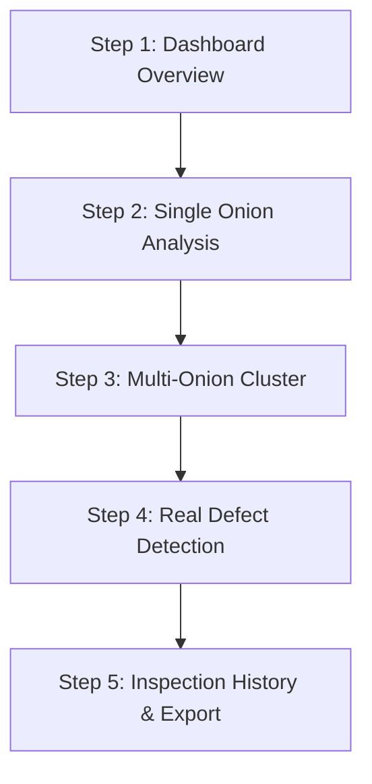

# ONIONVISION — DEMO GUIDE & LIVE PRESENTATION MANUAL

**System:** ONIONVISION AI-Based Onion Quality Inspection & Automated Grading System  
**Team:** THE DEBUGGERS  
**Phase:** 06 — Demo Hardening & Packaging  
**Document Version:** 1.0.0  

---

## 1. Prerequisites

Before launching the ONIONVISION demo environment, ensure the host machine meets the following baseline requirements:

| Component | Minimum Specification | Recommended Specification |
| :--- | :--- | :--- |
| **Operating System** | Windows 10/11 (64-bit) | Windows 11 (64-bit) |
| **Python** | Python 3.11 – 3.13 (64-bit) | Python 3.13 |
| **Node.js & npm** | Node.js v18+, npm v9+ | Node.js v24+, npm v11+ |
| **Memory (RAM)** | 8 GB | 16 GB |
| **Storage** | 2 GB free disk space | 5 GB SSD |
| **Browser** | Google Chrome, Microsoft Edge, or Firefox (modern evergreen) | Latest Google Chrome or Edge |
| **GPU (Optional)** | CPU inference supported (~50 ms) | NVIDIA CUDA GPU for batch acceleration |

### Pre-flight Environment Validation

Run the automated diagnostic tool before launching to verify all dependencies and files:
```powershell
backend\.venv\Scripts\python.exe scripts\check_demo_environment.py
```
Ensure all 13 checks report `[PASS]`.

---

## 2. One-Click Launch

For seamless live demonstration without manual terminal commands:

1. Navigate to the root directory `c:\Users\gmune\OneDrive\Desktop\ONION\`.
2. Double-click [run_onionvision.bat](file:///c:/Users/gmune/OneDrive/Desktop/ONION/run_onionvision.bat) (or execute in PowerShell):
   ```cmd
   run_onionvision.bat
   ```
3. What the launcher does automatically:
   - Validates repository root and dependencies.
   - Spawns the FastAPI backend server on [http://127.0.0.1:8000](http://127.0.0.1:8000) in a dedicated terminal window.
   - Spawns the Vite frontend server on [http://localhost:5173](http://localhost:5173) in a dedicated terminal window.
   - Polls `/api/health` until the machine learning models and database are ready.
   - Opens the default web browser directly to the ONIONVISION dashboard.

---

## 3. Manual Launch

If you prefer launching components in separate terminal windows:

### Terminal 1: Backend API & ML Service
```powershell
cd c:\Users\gmune\OneDrive\Desktop\ONION
backend\.venv\Scripts\python.exe -m uvicorn app.main:app --app-dir backend --host 127.0.0.1 --port 8000 --reload
```
*Wait for output:* `Application startup complete.`

### Terminal 2: Frontend Client
```powershell
cd c:\Users\gmune\OneDrive\Desktop\ONION\frontend
npm run dev
```
*Access UI at:* `http://localhost:5173/`

### Terminal 3: CLI Headless Verification (Optional)
```powershell
cd c:\Users\gmune\OneDrive\Desktop\ONION
backend\.venv\Scripts\python.exe scripts\run_demo.py
```

---

## 4. Demo Image Selection

All pre-packaged demo images are located in [data/demo/](file:///c:/Users/gmune/OneDrive/Desktop/ONION/data/demo/) and indexed in [DEMO_MANIFEST.json](file:///c:/Users/gmune/OneDrive/Desktop/ONION/data/demo/DEMO_MANIFEST.json):

| Directory | Image File | Highlights & Key Features | Calibration |
| :--- | :--- | :--- | :--- |
| `01_single_onion/` | `demo_single_onion.jpg` | Baseline single bulb segmentation, morphometry, and Grade A output. | Yes (59.0 mm calibrated) |
| `02_multiple_onions/` | `demo_multi_onion.jpg` | Simultaneous multi-onion detection (3 bulbs) with distinct mask boundaries. | No (scale uncalibrated) |
| `03_reference_calibration/`| `demo_calibration_disc.jpg` | Physical scale calibration against known reference disc (metric mm sizing). | Yes (60 mm reference disc) |
| `04_healthy/` | `demo_healthy_onion.jpg` | Premium commercial bulb, smooth outer skin, 100% healthy classification. | No (scale uncalibrated) |
| `05_unhealthy/` | `demo_unhealthy_onion.jpg` | Severe surface fungal/rot defect, classified Unhealthy with 100% confidence. | No (scale uncalibrated) |
| `06_difficult_cluster/` | `demo_cluster.jpg` | Overlapping adjacent bulbs separated by YOLOv8n-seg polygon contours. | No (scale uncalibrated) |
| `07_dataset3_external/` | `Onion-Bad2.jpg`, `Onion-Bad.jpg` | Harvard Dataverse external verification images (dark mold, Grade C). | No (scale uncalibrated) |

---

## 5. Recommended Demonstration Sequence

Follow this step-by-step 5-minute presentation flow for maximum impact:



### Step 1: Dashboard Overview (30 seconds)
- Point out real-time system metrics: Total Inspections, Total Bulbs Graded, Quality Distribution (Grade A, B, C, Reject).
- Highlight the **System Health status widget** confirming local YOLOv8n-seg and MobileNetV3-Small models are loaded and active.

### Step 2: Single Onion Inspection with Calibration (60 seconds)
- Click **"New Inspection"** in the top navigation.
- Drag-and-drop `data/demo/01_single_onion/demo_single_onion.jpg`.
- Check the **"Enable Auto-Calibration"** toggle with `known_reference_diameter_mm = 60.0`.
- Click **"Run Inspection"**.
- Point out the sub-100 ms inference response.
- Review results: 1 bulb detected, Calibrated diameter: ~59 mm, Health: Healthy (100%), Grade: Grade A, Status: `AUTO_ACCEPTABLE`.

### Step 3: Multi-Bulb Cluster Inspection (60 seconds)
- Upload `data/demo/02_multiple_onions/demo_multi_onion.jpg` or `data/demo/06_difficult_cluster/demo_cluster.jpg`.
- Observe polygon segmentation masks isolating each onion individually without bounding box overlap contamination.
- Click on individual onion rows in the **"Detected Bulbs"** list to inspect isolated crops, circularity index, and individual health scores.

### Step 4: Real Defect & Grading Engine Demonstration (60 seconds)
- Upload `data/demo/05_unhealthy/demo_unhealthy_onion.jpg`.
- Show that the system immediately flags the bulb as **Unhealthy** with >99% confidence.
- Note that the grading engine assigns **Grade C / Reject** due to disease classification, triggering the review badge `REVIEW_RECOMMENDED`.

### Step 5: Batch History & Report (30 seconds)
- Click **"Inspection History"** in the navigation bar.
- Show that all uploaded batches are persisted locally in SQLite with timestamps, counts, and grade distributions.
- Click into any historical inspection to reload full interactive visualization.

---

## 6. What to Say While Demonstrating (Presenter Script)

### Introduction
> *"Judges, manual onion sorting in post-harvest supply chains is labor-intensive, subjective, and prone to human error. ONIONVISION is an autonomous edge computer-vision system that performs real-time instance segmentation, metric morphometry, and health classification in a unified pipeline."*

### On Architecture & Models
> *"Rather than relying on uninterpretable end-to-end black boxes, ONIONVISION uses a modular, two-stage AI architecture: First, an ultra-lightweight YOLOv8 nano segmentation model isolates each onion bulb with pixel-level polygon masks. Second, individual masked crops are evaluated by a MobileNetV3 classifier trained exclusively on audited agricultural datasets."*

### On Scale Calibration & Physics
> *"Notice the metric measurements in millimeters. Computer vision bounding boxes alone cannot measure real fruit size without physical ground truth. Our calibration engine detects circular reference objects and computes real physical pixels-per-millimeter scale. When no reference is present, the system transparently reports uncalibrated status rather than hallucinating measurements."*

### On Robustness & Resilience
> *"The system is hardened for field deployment. If an invalid file or a blurry non-onion image is uploaded, the pipeline fails gracefully with structured feedback. All processing happens 100% locally on this machine without requiring internet access or cloud GPUs."*

---

## 7. Common Failures & Edge Cases Handled

| Edge Case | Expected System Behavior | Visual Indicator in UI |
| :--- | :--- | :--- |
| **No Onions in Image** | Pipeline completes with 0 detections; returns 200 OK. | Banner: "0 Onions Detected", clean empty state. |
| **No Calibration Disc** | System calculates pixel dimensions; sets `calibrated: false`. | Warning badge: "Scale Uncalibrated (Pixels Only)". |
| **Corrupted Image Upload** | Pillow validation gate intercepts stream; returns HTTP 400. | Error notification: "Corrupted image file or unsupported format". |
| **File > 15 MB** | Server request gate rejects upload; returns HTTP 413. | Error alert: "File size exceeds 15 MB limit". |
| **Low Classification Confidence** | Classification confidence < 80% triggers operator review. | Status badge: `REVIEW_RECOMMENDED`. |

---

## 8. Troubleshooting

### Problem: Port 8000 or 5173 is already in use
- **Remedy:** Run [stop_onionvision.bat](file:///c:/Users/gmune/OneDrive/Desktop/ONION/stop_onionvision.bat) to terminate any hanging instances, or execute in PowerShell:
  ```powershell
  Get-NetTCPConnection -LocalPort 8000,5173 -ErrorAction SilentlyContinue | ForEach-Object { Stop-Process -Id $_.OwningProcess -Force }
  ```

### Problem: Browser does not open automatically
- **Remedy:** Open Google Chrome or Edge manually and navigate to [http://localhost:5173](http://localhost:5173).

### Problem: Backend reports missing model weights
- **Remedy:** Verify `ml/models/weights/best_yolov8n_seg.pt` (6.5 MB) and `best_mobilenetv3_quality.pt` (3.8 MB) exist. If missing, verify path integrity via `scripts/check_demo_environment.py`.

---

## 9. Offline Operation

ONIONVISION is engineered for complete zero-network isolation:
- **No Remote Model Hubs:** YOLOv8 and PyTorch models load strictly from local disk paths.
- **No External Cloud APIs:** All inference, classification, and grading run on the local Python CPU/GPU.
- **Local Database:** SQLite database (`backend/onionvision.db`) operates locally without cloud database sync.
- **Bundled Frontend Assets:** Vite builds and packages all icons, Lucide components, and styling locally. System fonts (`Inter`, system UI sans-serif) render with native fallbacks when offline.

---

## 10. Shutdown

To cleanly terminate all running ONIONVISION processes and free network ports:

1. Double-click [stop_onionvision.bat](file:///c:/Users/gmune/OneDrive/Desktop/ONION/stop_onionvision.bat), or execute in PowerShell:
   ```cmd
   stop_onionvision.bat
   ```
2. The script gracefully terminates uvicorn and Vite processes and cleans up background ports 8000 and 5173.
