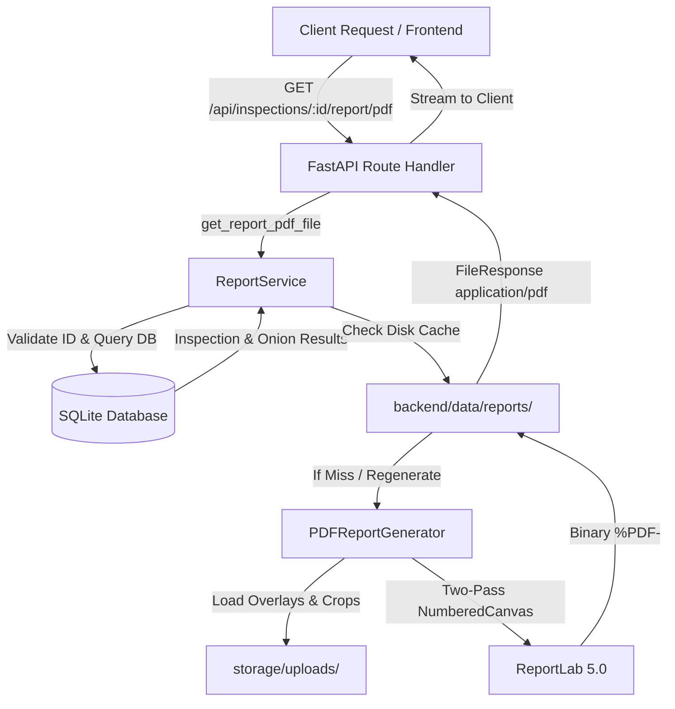

# ONIONVISION — Technical Report & PDF Export Specification

**Phase:** PHASE 07 — PROFESSIONAL REPORT / PDF EXPORT + FINAL BACKEND POLISH  
**Module:** `backend/app/services/pdf_generator.py` & `backend/app/services/report_service.py`  
**Status:** IMPLEMENTED & TESTED  

---

## 1. Executive Summary & Architecture

The ONIONVISION reporting architecture generates publication-grade, technical inspection reports for onion produce quality evaluation. All reports are compiled deterministically and entirely offline from actual inspection and metrology records stored in SQLite and local asset storage.

### Architectural Flow



---

## 2. PDF Generation Engine

The report generation engine is built using **ReportLab**, an offline, dependency-light, pure-Python library designed for deterministic document production without requiring headless browsers, Node dependencies, or cloud services.

### Key Capabilities
- **Two-Pass NumberedCanvas:** Dynamically records total page count to render accurate running headers and `"Page X of Y"` technical footers on all pages.
- **Embedded Visual Assets:** Dynamically integrates computer vision artifacts directly from local storage:
  - Full-resolution segmentation overlays (`{inspection_id}_overlay.jpg`) scaled with aspect-ratio preservation.
  - Individual onion bounding-box crops (`{inspection_id}_onion_{onion_number}_crop.jpg`).
- **Structured Typography & Palette:** Formatted using a curated technical palette:
  - Header & Primary Accents: Emerald (`#065f46`, `#10b981`)
  - Typography & Structure: Dark Slate (`#0f172a`, `#1e293b`), Muted Slate (`#64748b`)
  - Grade Indicators: Grade A (Green), Grade B (Blue), Grade C (Amber), Reject (Rose)
  - Layout Grid: Clean tables with explicit padding, column widths, and cell borders.

---

## 3. Metrology & Physical Measurement Integrity

A core tenet of the ONIONVISION project is **honest metrology**:
> **"ONIONVISION never invents, estimates without basis, or fabricates physical millimeter dimensions."**

### Calibrated vs. Uncalibrated Reporting

| Inspection State | Scale Factor | Header Notice | Individual Onion Size Metric |
| :--- | :--- | :--- | :--- |
| **Calibrated** (Reference disc detected + known constant provided) | Present (e.g. `4.76 px/mm`) | `CALIBRATED PHYSICAL MEASUREMENT: Metric millimeter values calculated using verified planar reference calibration.` | Reported in millimeters: `Calibrated Diameter: 52.4 mm` alongside raw pixel morphometry. |
| **Uncalibrated** (Marker absent or constant unconfigured) | `None` / `N/A` | `PIXEL MEASUREMENT ONLY: Physical measurements unavailable — reference-object calibration required.` | Strictly reports: `Physical measurements unavailable — reference-object calibration required.` (Millimeters omitted). |

---

## 4. API Endpoints

### 1. Download PDF Binary
- **Route:** `GET /api/inspections/{inspection_id}/report/pdf`
- **Alternative:** `GET /api/reports/{inspection_id}/pdf`
- **Content-Type:** `application/pdf`
- **Content-Disposition:** `attachment; filename="ONIONVISION_Report_{inspection_id}.pdf"`
- **Response:** Binary PDF stream.

### 2. Retrieve Report Metadata
- **Route:** `GET /api/inspections/{inspection_id}/report`
- **Alternative:** `GET /api/reports/{inspection_id}`
- **Response Model:** `ReportResponse`
```json
{
  "inspection_id": "INS-20260925-79E9737F",
  "status": "available",
  "file_path": "C:\\Users\\...\\backend\\data\\reports\\ONIONVISION_Report_INS-20260925-79E9737F.pdf",
  "created_at": "2026-09-26T05:03:00Z",
  "message": "Report retrieved successfully.",
  "pdf_url": "/api/inspections/INS-20260925-79E9737F/report/pdf",
  "file_size_bytes": 123898
}
```

---

## 5. Security & Path Traversal Guards

All report interactions enforce defensive security boundaries:
1. **Identifier Whitelisting:** Inspection IDs are validated against strict regex: `^INS-[A-Za-z0-9_-]+$`. Any identifier containing directory traversal characters (`..`, `/`, `\`) or invalid characters is rejected with `HTTP 400 Bad Request`.
2. **Server-Generated Filenames:** Clients cannot supply arbitrary filenames or destination paths. File paths are strictly generated server-side:
   ```python
   safe_id = re.sub(r"[^a-zA-Z0-9_-]", "_", inspection_id)
   target_path = (settings.reports_path / f"ONIONVISION_Report_{safe_id}.pdf").resolve()
   ```
3. **Directory Isolation:** Target paths are verified to reside strictly within `settings.reports_path` (`backend/data/reports/`):
   ```python
   if not str(target_path).startswith(str(settings.reports_path.resolve())):
       raise HTTPException(status_code=403, detail="Security violation: Invalid report destination path.")
   ```
4. **Missing Inspection Enforcement:** Non-existent inspection identifiers consistently return `HTTP 404 Not Found`.

---

## 6. Offline Operation

The reporting module operates in air-gapped / offline environments:
- **No Remote Font Downloads:** Standard Helvetica, Helvetica-Bold, and Courier fonts built into ReportLab core are utilized.
- **Local Assets Only:** Source images, overlays, and crops are read directly from local filesystem paths.
- **Zero Third-Party Cloud APIs:** PDF compilation is executed in-process on CPU with zero network egress.

---

## 7. Mandatory Technical Limitations & Disclaimers

Every generated ONIONVISION inspection report contains an explicit technical limitations section:

1. **Visible Surface Inspection Limitation:** Optical RGB cameras observe only the exposed outer tunic and epidermal layer. Internal physiological disorders, center rot, hollow heart, and black mold beneath dry tunics cannot be detected without destructive cross-sectioning or non-destructive spectral penetration.
2. **Internal Rot Disclaimer:** A "Healthy" classification on the visible exterior does not guarantee the complete absence of internal fungal or bacterial degradation.
3. **Scale Calibration Requirement:** Millimetric accuracy depends strictly on co-planar positioning of a known reference standard marker. In uncalibrated mode, metric dimensions are omitted to avoid metric fabrication.
4. **Prototype Grading Notice:** Quality tiers (Grade A/B/C/Reject) are generated by an experimental engineering prototype heuristic developed for Smart India Hackathon technical demonstration and do not constitute statutory or legal certification (e.g., AGMARK, NAFED, or USDA).
5. **Confidence Interpretation:** Machine learning confidence values represent neural network softmax certainty on visible features, not verified biological longevity or ground-truth laboratory accuracy.
6. **Decision Support:** Inspection reports are provided as operational decision-support assistance for sorting operations.
